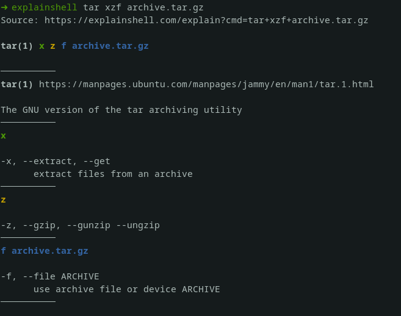

# explainshell-shell

Get help from [explainshell.com](https://explainshell.com), right from your shell.



## Usage

```shell
# General usage:
explainshell <command>

# For example:
explainshell tar xzf archive.tar.gz

# Show the help and info:
explainshell --help

# Disable color output:
explainshell --no-color <command>
```

## Development

```shell
# Run the shell.
go run ./cmd/explainshell.go

# Format the code.
go fmt ./...

# Build the binary.
go build ./cmd/explainshell.go
```

You can also build all the binaries (for Linux, Darwin, and Windows) using the `build.sh` script.
